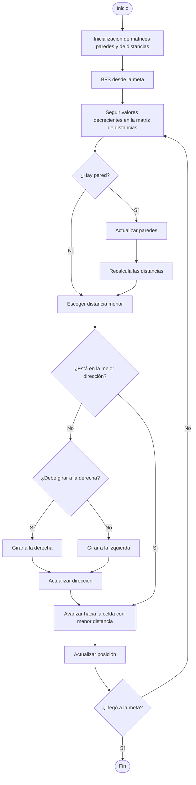

```mermaid
flowchart TD
    start(["Inicio"]) --> A["Inicializacion de matrices paredes y de distancias"]
    A --> B["BFS desde la meta"]
    B --> C["Seguir valores decrecientes en la matriz de distancias"]
    C --> D{"¿Hay pared?"}
    D -- Sí --> F["Actualizar paredes"]
    F --> G["Recalcula las distancias"]
    D -- No --> H["Escoger distancia menor"]
    G --> H
    H --> I{"¿Está en la mejor dirección?"}
    I -- No --> J{"¿Debe girar a la derecha?"}
    J -- Sí --> K["Girar a la derecha"]
    J -- No --> L["Girar a la izquierda"]
    K --> Z["Actualizar dirección"]
    L --> Z
    Z --> M["Avanzar hacia la celda con menor distancia"]
    I -- Sí --> M
    M --> N["Actualizar posición"]
    N --> O{"¿Llegó a la meta?"}
    O -- No --> C
    O -- Sí --> P(["Fin"])
```